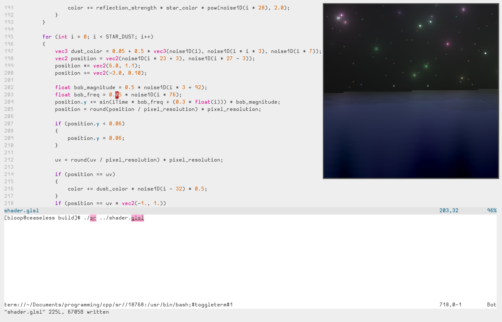

# sr

## Overview

SR (Shader Renderer) is a small utility to help make GLSL fragment shader art. It aims to recreate the shadertoy experience locally by featuring convenient uniforms and hot-reloading. Renders using Vulkan through SDL.



## Building

**TODO : Wrangle a full dependencies list**

1. Satisfy all dependencies.
2. Clone the project.
3. Run the included `init.sh` script to pull submodule dependencies and build the cmake directory (or do so manually).
4. Navigate into `build/` and build as is appropriate for your operating system (e.g. `make` for linux, etc).

## Usage

`sr [SHADER FILE]`

For example:

`sr mycoolshader.glsl`

## Shader Format

Shaders are expected to conform to Vulkan GLSL specs & implement the mainImage() function as shown below:

```
void mainImage(out vec4 fragColor, in vec2 fragCoord)
{
}
```

Shader files may access to the following uniforms:

```
float iTime         // Time since shader loaded (seconds).
float iFrame        // Time since shader loaded (elapsed frames)
vec2 iResolution    // Dimension of the viewport (pixels).
vec2 iMouse         // Location of the mouse (pixels).
```

See `examples/shader.glsl` for a basic example.

Includes and buffers are not supported at this time.

## Note

SR is still very much work in progress & may not perfectly replicate the shadertoy experience.
